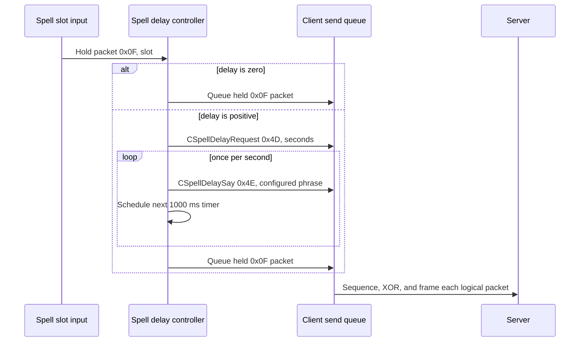

# UI, Input, and Packet Flows

This page connects visible in-game UI behavior to the internal Event system and the client and server packet actions that drive it. The most important distinction is ownership. Some panes are persistent and are only shown or hidden. Some are allocated in response to a server packet. Bulletin and mail use a longer-lived session object that repeatedly replaces its active child dialog.

The packet action byte is the first byte of the decoded logical packet. Packet offsets in this page are relative to that action byte unless stated otherwise.

## High-level operation

### End-to-end architecture

```mermaid
flowchart LR
    win["Win32 mouse and key messages"] --> queue["EventMan input queue"]
    queue --> input["Pane Event types 0 through 8"]
    input --> local["Pane mouse and key handlers"]
    local --> transition["Create, show, hide, or remove pane"]
    local --> builder["Client packet builder"]
    builder --> send["net_c_queue_send"]
    send --> encode["Sequence, XOR, and TCP frame"]
    encode --> server["Game server"]

    server --> tcp["TCP frame receive and XOR decode"]
    tcp --> socket["Pane socket Event type 9"]
    socket --> map["MapPane and registered child handlers"]
    map --> parser["Server-action parser"]
    parser --> transition
    parser --> state["Persistent pane or dialog fields"]
    state --> transition

    timer["Pane timers"] --> delay["Spell delay controller"]
    delay --> builder
```

Win32 messages do not call game panes directly. `win_main_window_proc` queues input in EventMan. The event worker converts it to internal Events, and the dispatcher calls the relevant pane virtual handler. Client packet builders then submit logical packets to `net_c_queue_send`.

The reverse path begins when the Socket worker completes and decodes a frame. EventMan creates Event type 9 and traverses the registered pane hierarchy. `MapPane` owns most in-game server actions, while persistent child panes such as the equipment, skill, and spell panes claim the actions that update their own state.

### Pane transition models

| Model | Examples | What "show" means | What closes or replaces it |
|---|---|---|---|
| Persistent content selection | status, chat, equipment, skill inventory, spell inventory | Hide the previous content pane through vslot `+0x18`, show the selected pane through `+0x14`, then store it at GameButtons `+0x124`. | Selecting another content pane. Equipment can also hide itself when selected twice. |
| Persistent server-populated pane | equipment, users | The object survives between updates. A packet changes fields and invalidates controls; visibility is a separate operation. | Equipment is hidden locally. The users pane survives after it is first created and can be repopulated. |
| Dynamic dialog | options, paper, screen menu, pursuit message variants, skill and spell detail dialogs | Allocate, construct controls, add to the Screen tree, and register in the Event tree. | The dialog's control or generic Dialog key path unregisters, removes, and deletes or defers deletion. |
| Session with replaceable child | bulletin and mail | Allocate one `BulletinSession`, then replace its current BoardList, ArticleList, Article, MailList, or Mail child as responses arrive. | Session destruction removes the active child and clears the static session root. |
| Dynamic slot children | individual skill and spell slots | Server add actions allocate a slot pane and add it to both registries. Parent inventory visibility is unchanged. | The matching server remove action unregisters, removes, deletes, and clears the indexed pointer. |

### Server actions that affect UI

| Server action | UI target | Creation or visibility effect | State effect and handler |
|---:|---|---|---|
| `SStatus` `0x08` | persistent status and related game panes | Does not select or show the status pane. | Updates already registered status fields through several pane-local handlers, including `Darkages.exe:0x0043F420` and `Darkages.exe:0x00441850`. |
| `SMessage` `0x0A`, subtype `8`, `9`, or `10` | generic message dialog | Allocates and registers a dynamic message dialog. Subtype `10` selects the alternate constructor mode. | A big-endian text length at packet `+2` controls the copied message. Tabs are normalized to carriage returns before construction. |
| `SSelfSaveOk` `0x21` | registered `OptionPane` | Allocates a local message dialog containing "Saved." | `ui_option_pane_handle_server_packet` claims the action. It reads no payload fields. |
| `SAddSpell` `0x17` | spell inventory slot | Allocates, adds, and registers one spell slot pane. It does not show the parent spell inventory. | `ui_spell_inventory_handle_server_packet` calls the add path after removing any old pane in the same slot. |
| `SRemoveSpell` `0x18` | spell inventory slot | Unregisters, removes, and deletes one slot pane. | Clears the indexed slot pointer. |
| `SEnterEditingMode` `0x1B` | paper dialog | Allocates the same Paper dialog class in mode 0. | Parses editing-mode fields before building controls. |
| `SAddSkill` `0x2C` | skill inventory slot | Allocates, adds, and registers one skill slot pane. It does not show the parent skill inventory. | `ui_skill_inventory_handle_server_packet` replaces the indexed slot. |
| `SRemoveSkill` `0x2D` | skill inventory slot | Unregisters, removes, and deletes one slot pane. | Clears the indexed slot pointer. |
| `SScreenMenu` `0x2F` | full-screen menu pane | Allocates a `0x104`-byte pane, adds it below `BackgroundPane`, and registers it. | `ui_screen_menu_pane_ctor` parses the packet and later menu responses can update the registered menu receiver. |
| `SPursuitMenu` `0x30` | message or question dialog family | Allocates one of seven dynamic variants according to packet `+1`. | Subtype `2` constructs `QuestionMessageDialog`; subtype `6` constructs `QuestionMessageFaceDialog`. The other five concrete source class names are not yet established. |
| `SBulletin` `0x31` | bulletin and mail session | Creates a session for an allowed unsolicited packet when no session exists, or replaces the active child in an existing session. | Subtypes `1` through `5` select board list, article list, article, mail list, and mail. Subtype `6` is accepted without creating a child. |
| `SShowPaper` `0x35` | paper dialog | Allocates a `0x560`-byte Paper dialog in mode 1 and registers it below `BackgroundPane`. | Mode 1 parses the server text and display flags before building controls. |
| `SShowUsers` `0x36` | persistent Users Dialog Pane | Populates the existing pane and explicitly shows it. | Parses list metadata and variable-length user records, enables row controls, starts a 100 ms pane timer, and invalidates the region. |
| `SAddEquip` `0x37` | persistent User Equip pane | Does not show the pane. | Stores a big-endian item identifier and length-prefixed name in the selected equipment slot, then redraws. |
| `SRemoveEquip` `0x38` | persistent User Equip pane | Does not hide the pane. | Clears the selected slot identifier and name, then redraws. |
| `SSelfLook` `0x39` | persistent User Equip pane and embedded legend/details | Does not show the pane. | Replaces character strings and appearance/detail fields, updates the embedded legend parser, and redraws. |
| `SCooldown` `0x3F` | skill or spell slot | Does not select the parent pane. | The skill and spell inventory handlers route the action to their respective slot cooldown update paths. |
| `SReconnect` `0x4C`, subtype `1` | exit-wait pane | Keeps the existing pane and replaces its warning with the safe-to-exit state. | Sends `CQuit` `0x0B`, subtype `0`, completing the orderly-exit exchange. This branch does not reconnect a socket. |

No established server action directly selects the persistent A/S/D/F/G content pane. Server status, skill, spell, and equipment actions update those panes even while another content pane is visible.

### Client actions that affect UI or packets

| Input or control action | Immediate UI effect | Client traffic | Server-driven continuation |
|---|---|---|---|
| `A` or inventory button | Selects equipment. If it is already current and visible, hides it. If it is current but hidden, shows it again. | Reopening the hidden current equipment pane first sends `CSelfLook` `0x2D`, one byte with no payload. Switching from another content pane sends no self-look request. | `SSelfLook` `0x39` refreshes data but does not itself show the pane. |
| `S` or skill button | Selects the persistent skill inventory and hides the previous content pane. | None merely for selection. | `SAddSkill`, `SRemoveSkill`, and `SCooldown` maintain its slot children. |
| `D` or spell button | Selects the persistent spell inventory and hides the previous content pane. | None merely for selection. | `SAddSpell`, `SRemoveSpell`, and `SCooldown` maintain its slot children. |
| `F` or chat button | Selects the persistent chat pane. | None merely for selection. | Chat controls emit their own message actions when text is submitted. |
| `G` or status button | Selects the persistent status pane. | None. | `SStatus` updates fields independently of selection. |
| `Q` or options button | Allocates and registers a new dynamic `OptionPane` below `BackgroundPane`. | The open action itself sends no packet. Option controls can send `CUserSetting` `0x1B` with one setting-code byte. | `SSelfSaveOk` `0x21` creates the local "Saved." message dialog while the pane is registered. |
| `X` while OptionPane owns the shortcut | Allocates `ui_exit_wait_pane` over the options UI. | Its constructor sends `CQuit` `0x0B`, subtype `1`. | `SReconnect` `0x4C`, subtype `1`, sends the subtype `0` completion and changes the pane to safe-to-exit text. |
| Right down on a skill slot | Allocates and registers `SkillBookDialog`. | None. | None required. |
| Activate a skill slot | Runs the slot's activation path. | Optional `CSpellDelaySay` `0x4E`, followed by `CUseSkill` `0x3E` with one slot byte. | Cooldown state can later arrive through action `0x3F`. |
| Right up on a spell slot | Allocates and registers `SpellBookDialog`. | None. | None required. |
| Activate a spell slot | Chooses an immediate, targeting, or text-input path from the spell's type byte. | The confirmed immediate path builds action `0x0F` plus one slot byte. With a configured delay it first sends `CSpellDelayRequest` `0x4D` and timed `CSpellDelaySay` `0x4E` packets, then sends the held `0x0F` packet. | Target selection or input completion supplies any additional cast context before the packet enters the delay controller. |
| `W` or bulletin button | Allocates and registers `BulletinSession`. | Sends `CBulletin` `0x3B`, subtype `1`. | `SBulletin` subtype `1` creates the first BoardList dialog. |
| Bulletin or mail navigation controls | Keeps the session and changes the active child when a response arrives. | `CBulletin` subtype `2` requests lists, `3` requests an article or mail, `4` posts an article, `5` deletes, `6` posts mail, and `7` changes article highlight state. | `SBulletin` subtypes `1` through `5` replace the active child. |
| `E` or users button | Lazily creates Users Dialog Pane, immediately hides it, and leaves it registered. Existing panes are reused. | Sends one-byte `CWho` `0x18` on every activation. | `SShowUsers` `0x36` parses the reply and shows the pane. |
| Screen-menu selection or text submission | Uses the currently registered `SScreenMenu` pane. | Sends `CMenuCode` `0x39`. Every traced variant begins with a menu type byte, a big-endian object identifier, and a big-endian menu code, followed by variant-specific selection or text. | Later `SScreenMenu` or `SPursuitMenu` traffic can replace or update the interaction. |
| Question dialog answer | Leaves the response to the dialog's answer virtual. | `QuestionMessageDialog` and its face variant send `CMessage` `0x3A`, including the dialog type, object and pursuit identifiers, response marker `1`, and selected answer byte. | Server pursuit traffic determines the next dialog. |
| Paper submit or editing completion | Normalizes carriage returns to tab bytes for the packet and closes through the Paper path. | Sends `CExitEditingMode` `0x23` with mode, a big-endian text length, and the text bytes. | Server behavior after submission is outside the local UI transition. |

### Bulletin and mail child replacement

The session owns a ten-entry dialog history array beginning at session `+0xF8`, the current index at `+0xF5`, and the active child at `+0x120`. Each successful response constructs a new dialog, detaches or queues deletion of superseded children, stores the new child in the history, sets the child's back-pointer to the session, and invokes the child's class-specific build/register virtual.

| `SBulletin` subtype | Child result | Matching client request family |
|---:|---|---|
| `1` | `BoardListDialog` | `CBulletin` subtype `1`, start session |
| `2` | `ArticleListDialog` | `CBulletin` subtype `2`, list request |
| `3` | `ArticleDialog` | `CBulletin` subtype `3`, article request |
| `4` | `MailListDialog` | `CBulletin` subtype `2`, mail-list request |
| `5` | `MailDialog` | `CBulletin` subtype `3`, mail request |
| `6` | No new child | Completion or acknowledgement for a prior write operation |

Article-list and mail-list responses are accepted only while the session's request-wait flag at `+0x124` is set. This prevents an unsolicited list response from replacing the active child.

### Spell-delay sequence

The spell slot builds the final action before the delay begins. The delay controller copies that logical packet into its own buffer and records its length, so the final timer callback does not reconstruct the cast.

The phrases are loaded from `SpellBook.cfg` and matched against the current spell name. A runtime packet hook that only watches the initial mouse event will therefore miss the later timer-owned final send.

### Runtime observation roots and useful fields

The virtual addresses below assume image base `0x00400000`. External tools should use `loaded_module_base + RVA`.

| VA | RVA | Current IDA name | Object and useful chain |
|---:|---:|---|---|
| `Darkages.exe:0x004E2D70` | `0x000E2D70` | `ui_bulletin_session` | Active heap `BulletinSession`, or null. Child history begins at `+0xF8`, current index is `+0xF5`, active child is `+0x120`, request-wait flag is `+0x124`. |
| `Darkages.exe:0x004E32A4` | `0x000E32A4` | `ui_equip_pane` | Persistent heap User Equip pane. Equipment identifiers begin at `+0xB22`; names are `0x80`-byte records beginning at `+0xB3E`; embedded legend/details owner begins at `+0x11CC`. |
| `Darkages.exe:0x004E3564` | `0x000E3564` | `ui_users_dialog_pane` | Heap Users Dialog Pane, or null before first `CWho`. It is reused across `SShowUsers` replies. |
| GameButtons owner field `+0x124` | dynamic | current content pane | Points at the currently selected status, chat, equipment, skill, or spell content pane. Find the owner through the Screen or Event registry. |
| GameButtons owner fields `+0x130` through `+0x140` | dynamic | content pane pointers | `+0x130` chat, `+0x134` status, `+0x138` equipment, `+0x13C` skill inventory, `+0x140` spell inventory. |

These pointers are observation roots, not synchronization primitives. Dialog removal may use deferred deletion, and the Screen and Event registries can change while another thread reads them. Validate the pane vtable and take a stable registry snapshot before following dynamic children. Writing a visible flag alone is unsafe because Screen composition, Event eligibility, capture, timers, and owner pointers must agree.

## Code-level flow

### Persistent content selection

`ui_game_buttons_handle_key_event` accepts Event type 8 and maps A/S/D/F/G to indices 0 through 4. `ui_game_buttons_select_content` dispatches to the relevant selector. A selector hides the previous pane through vslot `+0x18`, shows the new pane through `+0x14`, stores it at owner `+0x124`, updates the associated button layout, and redraws.

Equipment has an additional same-pane branch. `ui_game_buttons_select_inventory` calls `ui_pane_is_visible`. A visible current equipment pane is hidden. A hidden current pane causes `net_c_send_self_look` to queue action `0x2D`, then the pane is shown. This order means the old equipment data can become visible before the asynchronous `SSelfLook` reply arrives.

### Equipment and self-look

`ui_equip_pane_ctor` publishes `ui_equip_pane`, while its destructor clears the pointer. `ui_equip_pane_handle_server_packet` claims only actions `0x37`, `0x38`, and `0x39`.

`ui_equip_pane_add_item` reads the slot at packet `+1`, a big-endian identifier at `+2`, the name length at `+4`, and name bytes at `+5`. `ui_equip_pane_remove_item` reads the slot at `+1` and clears the corresponding fields. `ui_equip_pane_apply_self_look` replaces the larger appearance, identity, and legend state before invalidating the pane.

### Skill and spell inventories

`ui_skill_inventory_handle_server_packet` dispatches `0x2C`, `0x2D`, and `0x3F`. `ui_spell_inventory_handle_server_packet` dispatches `0x17`, `0x18`, and `0x3F`. Both add handlers first remove an existing pane at the packet-selected index, then allocate a class-specific slot object and add it to both registries. Both remove handlers perform the inverse sequence and clear the slot pointer.

`ui_skill_slot_handle_mouse_event` constructs `SkillBookDialog` on right-button down inside the slot. The activation branch sends the optional action `0x4E` phrase and then `net_c_send_use_skill`, which emits `[0x3E, slot]`.

`ui_spell_slot_handle_mouse_event` constructs `SpellBookDialog` on right-button up inside the slot. Its activation dispatcher selects immediate cast, targeted cast, or an input dialog from the spell type at slot `+0xF8`. `ui_spell_slot_begin_cast` builds `[0x0F, slot]` and passes it to `ui_spell_delay_begin`. A nonzero configured delay sends action `0x4D`, installs a 1000 ms callback, emits action `0x4E` phrases, and releases the held cast in `ui_spell_delay_handle_timer`.

### Bulletin and mail

`ui_window_buttons_show_bulletin_session` allocates `0x12C` bytes and calls `ui_bulletin_session_ctor` in client-opened mode. The constructor publishes `ui_bulletin_session`, adds and registers the session below `BackgroundPane`, then calls `net_c_send_bulletin_start`.

An unsolicited `SBulletin` reaches `ui_map_handle_bulletin`. When no session exists and the packet flag allows creation, the map handler allocates the same object in server-opened mode and passes the original packet to the constructor. When a session already exists, its registered socket handler claims the packet directly.

`ui_bulletin_session_process_packet` reads packet `+1` and dispatches to the five child processors. Each processor handles history cleanup, attaches the new child, sets the session back-pointer, and calls the child build virtual. Article and mail identifiers of zero produce a small "No More" dialog instead of an Article or Mail child.

### Users, paper, and server menus

Window button Q calls `ui_window_buttons_show_option_pane`, which allocates `0x578` bytes and constructs `OptionPane`. `ui_option_pane_ctor` installs `ui_option_pane_vtable`, builds the controls, and adds and registers the pane below `BackgroundPane`. Its mouse, key, socket, and timer vslots are all class-specific. Option controls call `net_c_send_user_setting`; a registered OptionPane claims `SSelfSaveOk` and constructs the local confirmation dialog. Its X shortcut constructs the exit-wait pane, beginning the two-step `CQuit` and `SReconnect` orderly-exit exchange.

Window button E always calls `net_c_send_who_request`. On first use it also allocates `Users Dialog Pane`, publishes `ui_users_dialog_pane`, adds and registers it, and immediately calls vslot `+0x18` to keep it hidden. `ui_map_handle_show_users` later obtains that static object, calls `ui_users_dialog_parse_server_list`, and then `ui_users_dialog_show`.

`ui_map_handle_show_paper` allocates Paper in mode 1. `SEnterEditingMode` uses the same constructor in mode 0. Both parsers eventually call `ui_paper_dialog_build_content`, which creates the controls, adds the dialog below `BackgroundPane`, and registers it.

`ui_paper_dialog_handle_completion` reads the text control, changes carriage returns to tab bytes, serializes `CExitEditingMode`, and closes the dialog when its completion conditions permit submission. `net_c_send_exit_editing_mode` uses the same packet layout without owning the close transition.

`ui_map_handle_screen_menu` allocates and constructs one full-screen menu pane for action `0x2F`. Menu interaction functions serialize `CMenuCode` action `0x39`. `ui_map_handle_pursuit_menu` reads packet `+1` and allocates one of seven message classes. The two friendly question class names are proven by constructor diagnostics and vtable installation. Their answer virtuals serialize `CMessage` action `0x3A`.

## Function table

| Address | Current IDA name | Prototype | Purpose | Call relationships and notes |
|---:|---|---|---|---|
| `Darkages.exe:0x0040EB10` | `ui_bulletin_session_ctor` | `void *__thiscall(void *, int, const uint8_t *)` | Construct and publish a bulletin/mail session. | Called for client-opened W flow and allowed unsolicited `SBulletin`. |
| `Darkages.exe:0x0040ECA4` | `net_c_send_bulletin_start` | `void __thiscall(void *)` | Send `CBulletin` subtype `1`. | Called by the client-opened session constructor path. |
| `Darkages.exe:0x0040ED04` | `ui_bulletin_session_process_packet` | `void __thiscall(void *, const uint8_t *)` | Dispatch `SBulletin` subtype. | Calls the five child-specific processors. |
| `Darkages.exe:0x0040EE64` | `ui_bulletin_session_process_board_list` | `void __thiscall(void *, const uint8_t *)` | Construct and attach BoardListDialog. | `SBulletin` subtype `1`. |
| `Darkages.exe:0x0040F8F4` | `ui_bulletin_session_process_article_list` | `void __thiscall(void *, const uint8_t *)` | Construct and attach ArticleListDialog. | `SBulletin` subtype `2`, gated by request-wait state. |
| `Darkages.exe:0x00410A14` | `ui_bulletin_session_process_article` | `void __thiscall(void *, const uint8_t *)` | Construct ArticleDialog or a no-more dialog. | `SBulletin` subtype `3`. |
| `Darkages.exe:0x004118F4` | `ui_bulletin_session_process_mail_list` | `void __thiscall(void *, const uint8_t *)` | Construct and attach MailListDialog. | `SBulletin` subtype `4`, gated by request-wait state. |
| `Darkages.exe:0x00412974` | `ui_bulletin_session_process_mail` | `void __thiscall(void *, const uint8_t *)` | Construct MailDialog or a no-more dialog. | `SBulletin` subtype `5`. |
| `Darkages.exe:0x0042EAF0` | `ui_equip_pane_handle_server_packet` | `int __thiscall(void *, void *)` | Claim equipment and self-look packets. | Calls add, remove, or full self-look parser. |
| `Darkages.exe:0x0042EBA4` | `ui_equip_pane_apply_self_look` | `void __thiscall(void *, const uint8_t *)` | Apply `SSelfLook`. | Updates the persistent pane without changing visibility. |
| `Darkages.exe:0x0043CF20` | `ui_game_buttons_handle_key_event` | `int __thiscall(void *, void *)` | Map A/S/D/F/G to content panes. | Calls `ui_game_buttons_select_content`. |
| `Darkages.exe:0x0043D164` | `ui_game_buttons_select_content` | `void __thiscall(void *, int8_t)` | Dispatch persistent pane selection. | Indices 0 through 4 are inventory, skills, spells, chat, status. |
| `Darkages.exe:0x0043D3D4` | `ui_game_buttons_select_inventory` | `void __thiscall(void *)` | Select or toggle equipment. | Hidden same-pane path sends `CSelfLook`. |
| `Darkages.exe:0x0043D4C4` | `net_c_send_self_look` | `void __cdecl(void)` | Send one-byte `CSelfLook`. | Queues action `0x2D`. |
| `Darkages.exe:0x0043E1B4` | `ui_window_buttons_select` | `void __thiscall(void *, int8_t)` | Dispatch Q/W/E window buttons. | Bulletin is index 1; users is index 2. |
| `Darkages.exe:0x0043E2B4` | `ui_window_buttons_show_option_pane` | `void __thiscall(void *)` | Create a dynamic OptionPane. | Q or window-button index 0. |
| `Darkages.exe:0x0043E384` | `net_c_send_who_request` | `void __cdecl(void)` | Send one-byte `CWho`. | Users list request, action `0x18`. |
| `Darkages.exe:0x00442990` | `ui_skill_inventory_handle_server_packet` | `int __thiscall(void *, void *)` | Maintain skill slot panes. | Handles `0x2C`, `0x2D`, and `0x3F`. |
| `Darkages.exe:0x00443B10` | `ui_spell_inventory_handle_server_packet` | `int __thiscall(void *, void *)` | Maintain spell slot panes. | Handles `0x17`, `0x18`, and `0x3F`. |
| `Darkages.exe:0x00445830` | `ui_users_dialog_parse_server_list` | `void __thiscall(void *, const uint8_t *)` | Populate Users Dialog Pane. | Called by `ui_map_handle_show_users` before showing. |
| `Darkages.exe:0x00454C64` | `net_c_send_use_skill` | `void __thiscall(void *)` | Send `[0x3E, slot]`. | Called by skill activation. |
| `Darkages.exe:0x00455684` | `ui_spell_slot_begin_cast` | `void __thiscall(void *)` | Build `[0x0F, slot]`. | Passes the logical packet to the delay controller. |
| `Darkages.exe:0x004556F4` | `ui_spell_delay_begin` | established `__thiscall` method | Hold or immediately send a spell packet. | Loads `SpellBook.cfg`, sends delay traffic, and installs timer callback 0. |
| `Darkages.exe:0x00455CA4` | `net_c_send_spell_delay_request` | `void __thiscall(void *, uint8_t)` | Send action `0x4D`. | Payload is configured delay seconds. |
| `Darkages.exe:0x00456940` | `ui_spell_delay_handle_timer` | `int __thiscall(void *, int, int, int)` | Advance delayed casting. | Sends action `0x4E` phrases and finally queues held `0x0F`. |
| `Darkages.exe:0x00469474` | `ui_map_handle_screen_menu` | `int __thiscall(void *, const uint8_t *)` | Create an `SScreenMenu` pane. | Allocates and calls `ui_screen_menu_pane_ctor`. |
| `Darkages.exe:0x0046C004` | `ui_map_handle_pursuit_menu` | `int __thiscall(void *, const uint8_t *)` | Create an `SPursuitMenu` dialog variant. | Dispatches subtype at packet `+1`. |
| `Darkages.exe:0x0046C3F4` | `ui_map_handle_show_paper` | `int __thiscall(void *, const uint8_t *)` | Create server-show Paper dialog. | Uses constructor mode 1. |
| `Darkages.exe:0x0046C464` | `ui_map_handle_show_users` | `int __thiscall(void *, const uint8_t *)` | Populate and show Users Dialog Pane. | Requires the pane created by the CWho input path. |
| `Darkages.exe:0x0046CAB4` | `ui_map_handle_bulletin` | `int __thiscall(void *, const uint8_t *)` | Handle sessionless `SBulletin`. | Creates server-opened session when allowed. |
| `Darkages.exe:0x0047EFC0` | `ui_question_message_dialog_ctor` | `void *__thiscall(void *, const uint8_t *)` | Construct QuestionMessageDialog. | `SPursuitMenu` subtype `2`. |
| `Darkages.exe:0x0047F9C0` | `ui_question_message_dialog_send_answer` | established `__thiscall` method | Send selected question answer. | Serializes 12 logical bytes beginning with `CMessage` `0x3A`. |
| `Darkages.exe:0x0047FC80` | `ui_question_message_face_dialog_ctor` | `void *__thiscall(void *, const uint8_t *)` | Construct faced question dialog. | `SPursuitMenu` subtype `6`. |
| `Darkages.exe:0x0048F600` | `ui_option_pane_ctor` | `void *__thiscall(void *)` | Build and register OptionPane. | Installs vtable `0x00520660`. |
| `Darkages.exe:0x004909E0` | `ui_option_pane_handle_server_packet` | `int __thiscall(void *, void *)` | Handle `SSelfSaveOk`. | Creates the local "Saved." message dialog. |
| `Darkages.exe:0x00490A80` | `ui_option_pane_handle_mouse_event` | `int __thiscall(void *, void *)` | Handle OptionPane mouse state. | Delegates common behavior to Dialog. |
| `Darkages.exe:0x00490D70` | `ui_option_pane_handle_timer` | `int __thiscall(void *, int, int, int)` | Advance OptionPane timer state. | Handles callback 100 separately. |
| `Darkages.exe:0x00490FE0` | `ui_option_pane_handle_key_event` | `int __thiscall(void *, void *)` | Handle OptionPane keyboard shortcuts. | Delegates unclaimed keys to Dialog. |
| `Darkages.exe:0x00491AA4` | `net_c_send_user_setting` | `void __thiscall(void *, uint8_t)` | Send `[0x1B, setting_code]`. | Called by OptionPane-family controls. |
| `Darkages.exe:0x004921F0` | `ui_exit_wait_handle_server_packet` | `int __thiscall(void *, void *)` | Complete orderly exit on action `0x4C`, subtype `1`. | Sends `CQuit` subtype `0` and changes the pane text. |
| `Darkages.exe:0x00492310` | `ui_exit_wait_pane_ctor` | established `__thiscall` constructor | Create exit-wait pane. | Sends `CQuit` subtype `1`. |
| `Darkages.exe:0x00492C10` | `ui_pane_is_visible` | `int __thiscall(void *)` | Query pane visibility. | Equipment same-pane toggle uses it. |
| `Darkages.exe:0x00492C40` | `ui_pane_show` | `void __thiscall(void *)` | Set visible state and invalidate. | Common vslot `+0x14`. |
| `Darkages.exe:0x00492D50` | `ui_pane_hide` | `void __thiscall(void *)` | Clear visible state and invalidate. | Common vslot `+0x18`. |
| `Darkages.exe:0x004939C0` | `ui_paper_dialog_ctor` | `void *__thiscall(void *, const uint8_t *, int)` | Construct Paper in either packet mode. | Reaches `ui_paper_dialog_build_content`. |
| `Darkages.exe:0x00493B60` | `ui_paper_dialog_handle_completion` | `int __thiscall(void *, int, int)` | Submit current Paper content when allowed, then close. | Queues `CExitEditingMode` through the common send queue. |
| `Darkages.exe:0x00494100` | `net_c_send_exit_editing_mode` | `void __thiscall(void *)` | Submit current Paper content. | Uses the same action `0x23` payload without closing the dialog. |
| `Darkages.exe:0x004A9BC0` | `ui_spell_book_dialog_ctor` | established `__thiscall` constructor | Construct local spell details. | Called on right-button up over a spell slot. |
| `Darkages.exe:0x004AB1D0` | `ui_skill_book_dialog_ctor` | established `__thiscall` constructor | Construct local skill details. | Called on right-button down over a skill slot. |
