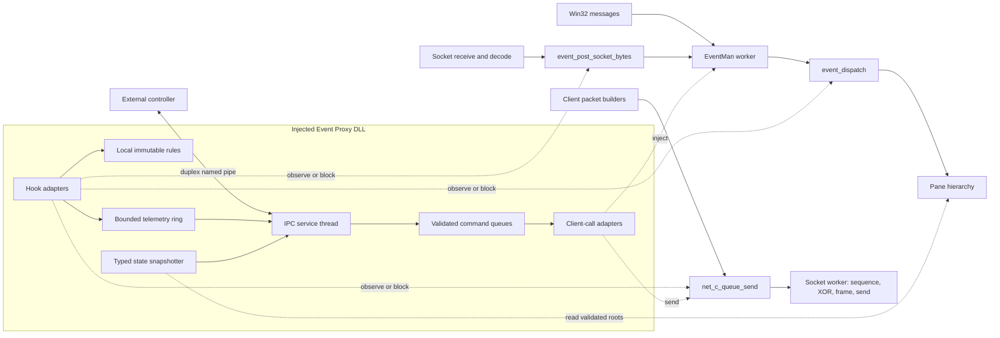

# Event Proxy Architecture

An Event Proxy can run inside the client and expose logical input, internal Events, decoded server packets, logical client packets, and selected runtime state to an external controller. It can provide most of the useful behavior of a network proxy without redirecting the TCP connection and without asking the controller to reproduce sequence, XOR, framing, or socket state.

This section is a development design based on confirmed Dark Ages 4.21 client boundaries. The client functions, object roots, ownership rules, and worker paths are established by static analysis. The injected DLL, IPC protocol, rule engine, and version resolver described here are proposed components and have not yet been implemented or validated by a controlled runtime experiment.

## High-level operation

### Design goals

The injected module should satisfy these requirements:

| Requirement | Design response |
|---|---|
| Observe all logical traffic | Hook decoded server packet posting, central internal Event dispatch, and logical client packet queueing. |
| Inject client-recognized events | Use the client's input queue functions, decoded packet posting function, and Event copy queue instead of calling pane handlers from the IPC thread. |
| Send any logical client packet | Pass an action and payload to `net_c_queue_send`; the Socket worker adds the sentinel, sequence, XOR transformation, frame, and transport send. |
| Block without an IPC round trip | Evaluate an immutable local ruleset in the hook and make the pass or block decision before telemetry is sent. |
| Continue when no controller exists | The initial and fallback policy is pass-through. Hook execution never waits for the pipe. |
| Survive controller exit and reconnect | The DLL owns a persistent named-pipe accept loop. A controller connection is a replaceable session, not the lifetime of the injected module. |
| Supply state after late attach | Produce a stable typed snapshot from static roots and active pane trees, then replay events newer than the snapshot boundary. |

"All events" means every event category the mapped client recognizes. Mouse Event types are 0 through 7, keyboard is type 8, and decoded server packets are type 9. Pane timers are a separate callback path and are not Event objects. Unknown Event type values reach an assertion path instead of a generic extension handler, so the public IPC API should reject unknown types.

### Component layout



The hooks remain synchronous only for the local decision. Telemetry is copied into a bounded ring and delivered later by the IPC thread. Commands travel in the other direction through proxy-owned queues or through client functions that already copy and enqueue their input.

### Hook layers

Three primary hooks cover different semantics:

1. `event_post_socket_bytes` sees one decoded server packet before Event creation. It is the cleanest inbound packet filter because skipping the original call prevents allocation and pane delivery.
2. `event_dispatch` sees one logical Event before hierarchy fan-out. It covers input and packets at a common point and preserves the dispatcher's normal cleanup when a hook reports the Event consumed.
3. `net_c_queue_send` sees one logical client packet before the sequence byte, XOR transformation, frame header, and Winsock call. It is both the outbound observation point and the normal send-injection API.

Hooking `event_dispatch_hierarchy` alone is not a replacement for the central Event hook. It is recursive, visits children before parents, translates mouse coordinates during traversal, and may be called more than once for one Event. It is useful for pane-specific diagnostics, but it produces duplicate observations and is a poor global blocking boundary.

### Injection lifecycle

The DLL entry point should do only loader-safe work. Windows holds the loader lock while it calls `DllMain`, so starting IPC, resolving imports, installing hooks, or waiting for client initialization there can deadlock with other module loads. A small entry point can disable thread notifications and arrange for initialization after `LoadLibrary` returns. Injector-assisted invocation of an exported `proxy_start` function is the cleanest option. A separately created bootstrap thread is a practical fallback.

The proxy lifecycle should be explicit:

| Proxy state | Allowed behavior |
|---|---|
| `loaded` | Record module handle and reject IPC work. |
| `resolving` | Fingerprint the image, resolve a known profile, and validate every required symbol. |
| `passive` | Run IPC and state reads, but do not install mutation-capable hooks when validation is incomplete. |
| `active` | Hooks, local rules, telemetry, packet injection, and typed snapshots are available. |
| `draining` | Reject new mutations, use pass-through rules, stop command execution, and remove hooks. |
| `detached` | Close proxy-owned handles and leave no client callback pointing into the DLL. |

Early injection does not require guessing how long initialization takes. The bootstrap can validate the image immediately, then wait until `event_dispatcher`, `event_manager_instance`, and `net_socket_instance` are nonnull and have their expected vtables. Late injection follows the same validation and can enter `active` as soon as those roots are stable.

`app_shutdown` is the critical detach boundary. It destroys EventMan, whose destructor destroys its owned Socket and clears `net_socket_instance`, before the final dispatcher destruction. The proxy should intercept shutdown entry, enter `draining`, stop accepting mutating commands, atomically select a pass-through ruleset, wait for in-flight hook calls to leave, and remove hooks in reverse order. It must not depend on a client worker shutdown notification because the shared worker destructor uses `TerminateThread` rather than a cooperative stop and join.

### Failure isolation and pass-through

The injected module is part of the game process, so its failure policy must favor the unmodified client path:

- A missing or unknown build profile disables hooks that can mutate state.
- No controller connection means pass-through unless an explicitly persistent local ruleset is installed.
- A full telemetry ring drops telemetry, increments a loss counter, and continues the client call.
- A malformed IPC message is rejected before it reaches a client function.
- A controller timeout never blocks a client worker.
- A hook reentry guard prevents a rule-generated packet from recursively generating the same rule action without a limit.
- Shutdown invalidates all cached client pointers before closing the pipe.

Session rules should be removed automatically when their controller disconnects. Persistent rules should require an explicit flag and remain local to the DLL across reconnects. This distinction preserves seamless default pass-through while still allowing a block rule to operate without live IPC.

## Code-level flow

### Activation path

1. Fingerprint the loaded `Darkages.exe` image and select a version profile.
2. Resolve every required RVA to `loaded_module_base + rva`.
3. Decode and validate the expected instructions, call relationships, globals, and vtables before changing code.
4. Start the pipe accept loop and publish passive build and capability information.
5. Wait for `event_dispatcher`, `event_manager_instance`, and `net_socket_instance` to be live.
6. Install the inbound, Event, and outbound hooks. Install the optional dispatcher-tick command pump only if pane-thread commands are enabled.
7. Atomically change the capability state to active.

Hook installation should use one transaction where the hooking library supports it. If any required hook fails, roll back the complete set and remain passive. A partial set can create misleading ordering, such as allowing injected packets without observing the resulting outbound queue.

### Normal packet and Event flow

```text
decoded server packet
  -> inbound local rules
      -> block: return without event posting
      -> pass or copy-on-write modify
          -> event_post_socket_bytes
              -> EventMan work code 0x0E
                  -> Event type 9
                      -> central Event rules
                          -> block: report consumed; dispatcher still frees payload
                          -> pass: event_dispatch hierarchy fan-out

client builder or proxy command
  -> outbound local rules
      -> block: return without queue allocation
      -> pass or copy-on-write modify
          -> net_c_queue_send
              -> Socket work code 5
                  -> sequence, XOR, frame, send
```

The inbound and Event hooks can both observe a server packet. Telemetry therefore includes a phase field. A default subscription should publish decoded ingress at the first hook and suppress the duplicate type 9 record at the central Event hook unless the controller explicitly requests both phases.

### Optional dispatcher-thread command pump

Most commands do not need a custom scheduler. `event_post_socket_bytes`, the native input queue functions, and `net_c_queue_send` copy their inputs into existing client queues. Direct pane operations and timer-list operations are different because they touch state owned by the dispatcher worker.

An optional hook on `event_dispatcher_tick` can drain a small, fixed number of proxy commands on that worker before calling the original tick. The drain must have a time or item budget so telemetry, deferred deletion, and timers cannot be starved. Commands should carry a generation and cancellation token so a disconnected controller cannot leave stale pane operations queued.

Direct calls to `event_dispatcher_insert_timer` from the IPC thread are not safe. The function edits the timer list without a visible lock and is normally reached on the dispatcher worker. A timer injection command must run through the dispatcher-thread pump and should target only an established receiver and callback identifier.

### Shutdown path

1. Enter `draining` at `app_shutdown` entry or when the required roots begin teardown.
2. Reject packet sends, Event injection, timer work, and memory writes.
3. Swap in the pass-through ruleset and stop rule-generated actions.
4. Disconnect the current controller and stop the accept loop.
5. Wait for the hook active-call counter to reach zero.
6. Remove the optional tick hook, outbound hook, Event hook, and inbound hook.
7. Clear cached roots, close proxy-owned handles, and mark the module detached.

The proxy should normally remain loaded until process exit. Calling `FreeLibrary` while another client worker might still execute a trampoline or callback into the module is more dangerous than retaining a small inert DLL.

## Function table

| Address | Current IDA name | Prototype | Purpose | Call relationships and notes |
|---:|---|---|---|---|
| `Darkages.exe:0x004315B0` | `event_dispatcher_tick` | `void __thiscall(void *event_dispatcher_object)` | Run deferred deletion and one due timer. | Optional bounded proxy command-pump location because it runs on the dispatcher worker. |
| `Darkages.exe:0x00431B84` | `event_dispatch` | `int __thiscall(void *event_dispatcher_object, void *event)` | Dispatch one logical Event. | Primary central Event observation and block boundary before hierarchy fan-out. |
| `Darkages.exe:0x00431D54` | `event_dispatch_hierarchy` | `int __thiscall(void *event_dispatcher_object, void *event, void *hierarchy)` | Recursively deliver an Event to panes. | Useful for targeted diagnostics, not for one-record-per-Event telemetry. |
| `Darkages.exe:0x00432E50` | `event_post_socket_bytes` | `void __thiscall(void *event_manager_object, const uint8_t *packet, int length)` | Copy a decoded server packet and post work code `0x0E`. | Primary decoded inbound packet hook and injection adapter. |
| `Darkages.exe:0x00432F10` | `event_manager_queue_event_copy` | `void __thiscall(void *event_manager_object, const void *event)` | Copy a 36-byte Event and post EventMan work code `0x0F`. | No native call sites are present in this build; usable only with a validated Event layout. |
| `Darkages.exe:0x004A3570` | `net_c_queue_send` | `void __thiscall(void *socket_object, const uint8_t *packet, int16_t length)` | Copy and queue one logical client packet. | Primary outbound hook and normal client-packet injection adapter. |
| `Darkages.exe:0x0045B8F0` | `app_shutdown` | `void __cdecl(void)` | Tear down application subsystems. | Proxy draining and hook-removal boundary. |
| `Darkages.exe:0x0045CCA0` | `app_initialize` | `void __cdecl(void)` | Construct the dispatcher, EventMan, Socket, screen, and other subsystems. | Early-injection readiness boundary. |
| `Darkages.exe:0x004BF440` | `util_thread_queue_post_async` | `void __thiscall(void *worker_object, int code, void *data, int value)` | Append an asynchronous worker record and release the queue semaphore. | Does not copy `data`; ownership is defined by each caller-specific wrapper. |
