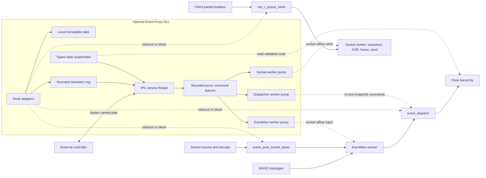

# Event Proxy Architecture

An Event Proxy can run inside the client and expose logical input, internal Events, decoded server packets, logical client packets, and selected runtime state to an external controller. It can provide most of the useful behavior of a network proxy without redirecting the TCP connection and without asking the controller to reproduce sequence, XOR, framing, or socket state.

This section is a development design based on confirmed Dark Ages 4.21 client boundaries. The client functions, object roots, ownership rules, and worker paths are established by static analysis. The injected DLL, IPC protocol, rule engine, and version resolver described here are proposed components and have not yet been implemented or validated by a controlled runtime experiment.

## High-level operation

### Design goals

The injected module should satisfy these requirements:

| Requirement | Design response |
|---|---|
| Observe all logical traffic | Hook decoded server packet posting, central internal Event dispatch, and logical client packet queueing. |
| Inject client-recognized events | Admit commands into bounded proxy queues and execute the established packet, input, or pane action from its owning client worker. |
| Send any logical client packet | Queue an action and payload for the Socket worker pump; it appends the sentinel and enters `net_c_send_packet_body`, which adds sequence, XOR transformation, frame, and transport send. |
| Block without an IPC round trip | Evaluate an immutable local ruleset in the hook and make the pass or block decision before telemetry is sent. |
| Continue when no controller exists | The initial and fallback policy is pass-through. Hook execution never waits for the pipe. |
| Survive controller exit and reconnect | The DLL owns a persistent named-pipe accept loop. A controller connection is a replaceable session, not the lifetime of the injected module. |
| Supply state after late attach | Produce a stable typed snapshot from static roots and active pane trees, then replay events newer than the snapshot boundary. |

"All events" means every event category the mapped client recognizes. Mouse Event types are 0 through 7, keyboard is type 8, and decoded server packets are type 9. Pane timers are a separate callback path and are not Event objects. Unknown Event type values reach an assertion path instead of a generic extension handler, so the public IPC API should reject unknown types.

### Component layout



The hooks remain synchronous only for the local decision. Telemetry is copied into a bounded ring and delivered later by the IPC thread. Commands travel in the other direction through bounded proxy-owned queues. The target client worker drains each queue so IPC code does not call a live client object from an unrelated thread.

### Threading model and pump placement

The named-pipe pump should run on a proxy-owned thread, but that thread should stop at framing, validation, ruleset compilation, command admission, and response serialization. It should not call `net_c_queue_send`, `event_post_socket_bytes`, pane methods, or timer methods.

The strongest 4.21 design has one bounded command queue for each client ownership domain:

| Queue | Execution context | Wake and pump point | Allowed work |
|---|---|---|---|
| Socket commands | Socket worker | Signal wait handle 0 at Socket `+0x14`; drain from the `net_socket_vtable +0x10` callback around `net_poll_receive` | Logical client packet sends and Socket-owned queries. |
| EventMan commands | EventMan worker | Signal wait handle 0 at EventMan `+0x14`; replace or wrap `event_manager_vtable +0x10`, whose native target is `event_manager_periodic_noop` | Decoded server packet and normalized input injection. |
| Dispatcher commands | Dispatcher worker | Signal wait handle 0 at dispatcher `+0x14`; drain from a bounded `event_dispatcher_tick` hook | Pane methods, timer operations, snapshot barriers, and validated UI writes. |

This wake mechanism is supported by the generic worker loop. A wait-handle-0 wake first checks whether the native ring is empty. If it is empty, the loop skips the native pop and still invokes virtual slot `+0x10`. A proxy can therefore enqueue into its own ring, release the existing work semaphore once, and let the correct client worker enter the class-specific pump without adding a fake native work record.

Command admission and the matching `ReleaseSemaphore` call must run inside a proxy lifecycle read guard. Admission rechecks the `active` state after acquiring the guard, validates the live root, vtable, and wait handle, copies the command, and checks the wake result before leaving. The shutdown hook changes the state to `draining` and waits for these guards before the original client can close any worker handle. This closes the race where an IPC thread captures Socket or EventMan `+0x14` immediately before destruction.

Each pump should call the original periodic method and then process a small fixed number of commands. The Socket and EventMan pumps can normally process one packet per wake. The dispatcher pump needs both an item limit and a short elapsed-time budget because its thread runs at `THREAD_PRIORITY_TIME_CRITICAL` and also owns deferred deletion and timers. None of the pumps should wait for pipe I/O or a controller response.

The client native queues are synchronized, so a simpler first implementation can use a separate proxy command-executor thread that calls `net_c_queue_send` and `event_post_socket_bytes`. This does not race the native ring indices. It is not the preferred final design because both wrappers can wait indefinitely when their 128-record queues are full, and a blocked foreign producer complicates Socket and EventMan destruction. Never make those calls on the named-pipe accept or read thread.

### Hook layers

Three primary hooks cover different semantics:

1. `event_post_socket_bytes` sees one decoded server packet before Event creation. It is the cleanest inbound packet filter because skipping the original call prevents allocation and pane delivery.
2. `event_dispatch` sees one logical Event before hierarchy fan-out. It covers input and packets at a common point and preserves the dispatcher's normal cleanup when a hook reports the Event consumed.
3. `net_c_queue_send` sees one native logical client packet before the sequence byte, XOR transformation, frame header, and Winsock call. It is the outbound observation point and a synchronized fallback injection adapter. The preferred controller injection path runs on the Socket worker and enters `net_c_send_packet_body` directly.

Hooking `event_dispatch_hierarchy` alone is not a replacement for the central Event hook. It is recursive, visits children before parents, translates mouse coordinates during traversal, and may be called more than once for one Event. It is useful for pane-specific diagnostics, but it produces duplicate observations and is a poor global blocking boundary.

### Injection lifecycle

The DLL entry point should do only loader-safe work. Windows holds the loader lock while it calls `DllMain`, so starting IPC, resolving imports, installing hooks, or waiting for client initialization there can deadlock with other module loads. A small entry point can disable thread notifications and arrange for initialization after `LoadLibrary` returns. Injector-assisted invocation of an exported `proxy_start` function is the cleanest option. A separately created bootstrap thread is a practical fallback.

The proxy lifecycle should be explicit:

| Proxy state | Allowed behavior |
|---|---|
| `loaded` | Record module handle and reject IPC work. |
| `resolving` | Fingerprint the image, resolve a known profile, and validate every required symbol. |
| `passive` | Run IPC and state reads, but do not install mutation-capable hooks when validation is incomplete. |
| `active` | Hooks, local rules, telemetry, packet injection, and typed snapshots are available. |
| `draining` | Reject new mutations, use pass-through rules, stop command execution, and remove hooks. |
| `detached` | Close proxy-owned handles and leave no client callback pointing into the DLL. |

Early injection does not require guessing how long initialization takes. The bootstrap can validate the image immediately, then wait until `event_dispatcher`, `event_manager_instance`, and `net_socket_instance` are nonnull and have their expected vtables. Late injection follows the same validation and can enter `active` as soon as those roots are stable.

`app_shutdown` is the critical detach boundary. It destroys EventMan, whose destructor destroys its owned Socket and clears `net_socket_instance`, before the final dispatcher destruction. The proxy should intercept shutdown entry, enter `draining`, stop accepting mutating commands, atomically select a pass-through ruleset, wait for in-flight hook calls to leave, and remove hooks in reverse order. It must not depend on a client worker shutdown notification because the shared worker destructor uses `TerminateThread` rather than a cooperative stop and join.

### Failure isolation and pass-through

The injected module is part of the game process, so its failure policy must favor the unmodified client path:

- A missing or unknown build profile disables hooks that can mutate state.
- No controller connection means pass-through unless an explicitly persistent local ruleset is installed.
- A full telemetry ring drops telemetry, increments a loss counter, and continues the client call.
- A malformed IPC message is rejected before it reaches a client function.
- A controller timeout never blocks a client worker.
- A hook reentry guard prevents a rule-generated packet from recursively generating the same rule action without a limit.
- Shutdown invalidates all cached client pointers before closing the pipe.

Session rules should be removed automatically when their controller disconnects. Persistent rules should require an explicit flag and remain local to the DLL across reconnects. This distinction preserves seamless default pass-through while still allowing a block rule to operate without live IPC.

## Code-level flow

### Activation path

1. Fingerprint the loaded `Darkages.exe` image and select a version profile.
2. Resolve every required RVA to `loaded_module_base + rva`.
3. Decode and validate the expected instructions, call relationships, globals, and vtables before changing code.
4. Start the pipe accept loop and publish passive build and capability information.
5. Wait for `event_dispatcher`, `event_manager_instance`, and `net_socket_instance` to be live.
6. Install the inbound, Event, and outbound hooks. Install the Socket and EventMan worker pumps for packet mutation capabilities, and the dispatcher pump for pane, timer, write, or snapshot capabilities.
7. Atomically change the capability state to active.

Hook installation should use one transaction where the hooking library supports it. If any required hook fails, roll back the complete set and remain passive. A partial set can create misleading ordering, such as allowing injected packets without observing the resulting outbound queue.

### Normal packet and Event flow

```text
decoded server packet
  -> inbound local rules
      -> block: return without event posting
      -> pass or copy-on-write modify
          -> event_post_socket_bytes
              -> EventMan work code 0x0E
                  -> Event type 9
                      -> central Event rules
                          -> block: report consumed; dispatcher still frees payload
                          -> pass: event_dispatch hierarchy fan-out

native client builder
  -> outbound local rules
      -> block: return without queue allocation
      -> pass or copy-on-write modify
          -> net_c_queue_send
              -> Socket work code 5
                  -> sequence, XOR, frame, send

proxy client command
  -> bounded Socket command queue and worker wake
      -> Socket periodic pump
          -> outbound local rules and telemetry
              -> net_c_send_packet_body
                  -> sequence, XOR, frame, send
```

The inbound and Event hooks can both observe a server packet. Telemetry therefore includes a phase field. A default subscription should publish decoded ingress at the first hook and suppress the duplicate type 9 record at the central Event hook unless the controller explicitly requests both phases.

### Worker-affine packet pumps

For a client packet, the Socket pump validates the live root and vtable, checks the same transfer gate used by `net_c_queue_send`, applies outbound rules, appends the zero sentinel in proxy-owned storage, and calls `net_c_send_packet_body` with `logical_length + 1`. Static analysis shows that this function reads the input synchronously, applies the normal sequence, XOR, framing, and `send` path, and neither retains nor frees the input pointer. The proxy pump must emit the `controller` or `local_rule` telemetry itself because this route intentionally does not re-enter the `net_c_queue_send` hook.

For a server packet, the EventMan pump allocates `logical_length + 1` through `util_memory_manager_alloc`, copies the logical bytes, appends zero, and calls `event_process_work_item(event_manager, 0x0E, owned_packet, logical_length)` on the EventMan worker. Code `0x0E` transfers the packet into Event type 9 and the dispatcher later releases it through `util_memory_manager_free`. A DLL-heap pointer must not be passed into this ownership path.

Input injection belongs on the same EventMan pump. It can invoke the established worker-side work-code behavior with the same normalized scan code, message time, coordinates, or wheel delta that the native wrappers would have queued. This avoids self-enqueueing into EventMan's bounded ring from its own consumer thread.

Direct pane operations and timer-list operations remain dispatcher-only. `event_dispatcher_insert_timer` edits the timer list without a visible lock. A timer injection command must run through the dispatcher pump and should target only an established receiver and callback identifier. All commands carry a connection generation and cancellation token so a disconnected controller cannot leave stale work queued.

The Socket worker processes at most one native record and then calls its periodic method. A proxy send performed there is therefore serialized with sequence and transport state, but it is not in a single chronological FIFO with the remaining native Socket queue. If strict native-versus-controller admission order is required, use `net_c_queue_send` from one dedicated executor and accept its blocking full-queue behavior, or implement a separately validated unified admission hook.

### Shutdown path

1. Enter `draining` at `app_shutdown` entry, before the original function deletes EventMan and its owned Socket.
2. Reject new mutations, stop worker wake signals, cancel queued commands, and atomically select pass-through rules.
3. Disconnect the current controller and stop the accept loop. Use overlapped pipe I/O or explicit cancellation so this step cannot wait indefinitely on a blocked pipe read or connect.
4. Wait for IPC admission and wake guards, the Socket, EventMan, and dispatcher pumps, and ordinary hook active-call counters to reach zero while all three client workers are still alive.
5. Restore worker vtable slots and remove the dispatcher, outbound, Event, and inbound hooks in reverse order.
6. Clear cached roots and call the original `app_shutdown`. The EventMan destructor then deletes the Socket, clears both roots, and tears down their workers.
7. Close proxy-owned handles and mark the module detached.

The proxy should normally remain loaded until process exit. Calling `FreeLibrary` while another client worker might still execute a trampoline or callback into the module is more dangerous than retaining a small inert DLL.

## Function table

| Address | Current IDA name | Prototype | Purpose | Call relationships and notes |
|---:|---|---|---|---|
| `Darkages.exe:0x004315B0` | `event_dispatcher_tick` | `void __thiscall(void *event_dispatcher_object)` | Run deferred deletion and one due timer. | Optional bounded proxy command-pump location because it runs on the dispatcher worker. |
| `Darkages.exe:0x00431B84` | `event_dispatch` | `int __thiscall(void *event_dispatcher_object, void *event)` | Dispatch one logical Event. | Primary central Event observation and block boundary before hierarchy fan-out. |
| `Darkages.exe:0x00431D54` | `event_dispatch_hierarchy` | `int __thiscall(void *event_dispatcher_object, void *event, void *hierarchy)` | Recursively deliver an Event to panes. | Useful for targeted diagnostics, not for one-record-per-Event telemetry. |
| `Darkages.exe:0x00432E50` | `event_post_socket_bytes` | `void __thiscall(void *event_manager_object, const uint8_t *packet, int length)` | Copy a decoded server packet and post work code `0x0E`. | Primary decoded inbound packet hook and synchronized fallback injection adapter. |
| `Darkages.exe:0x00432F10` | `event_manager_queue_event_copy` | `void __thiscall(void *event_manager_object, const void *event)` | Copy a 36-byte Event and post EventMan work code `0x0F`. | No native call sites are present in this build; usable only with a validated Event layout. |
| `Darkages.exe:0x00434080` | `event_manager_periodic_noop` | `void __thiscall(void *event_manager_object)` | Native no-op EventMan periodic callback. | `event_manager_vtable +0x10`; practical vtable-slot pump for EventMan-affine commands. |
| `Darkages.exe:0x0045B8F0` | `app_shutdown` | `void __cdecl(void)` | Tear down application subsystems. | Proxy draining and hook-removal boundary. |
| `Darkages.exe:0x0045CCA0` | `app_initialize` | `void __cdecl(void)` | Construct the dispatcher, EventMan, Socket, screen, and other subsystems. | Early-injection readiness boundary. |
| `Darkages.exe:0x004A3570` | `net_c_queue_send` | `void __thiscall(void *socket_object, const uint8_t *packet, int16_t length)` | Copy and queue one logical client packet. | Primary native outbound hook and synchronized native-queue fallback adapter; admission can block. |
| `Darkages.exe:0x004A39C0` | `net_poll_receive` | `void __thiscall(void *socket_object)` | Poll receive state from the Socket periodic worker callback. | `net_socket_vtable +0x10`; recommended bounded Socket command-pump hook. |
| `Darkages.exe:0x004A72B4` | `net_c_send_packet_body` | `void __thiscall(void *socket_object, const uint8_t *packet, int16_t length)` | Apply client transform and framing, then call `send`. | Socket-worker-affine packet adapter; input is read synchronously and is not retained or freed. |
| `Darkages.exe:0x004BF440` | `util_thread_queue_post_async` | `void __thiscall(void *worker_object, int code, void *data, int value)` | Append an asynchronous worker record and release the queue semaphore. | Does not copy `data` or wait for completion, but can block while the bounded ring is full. |
